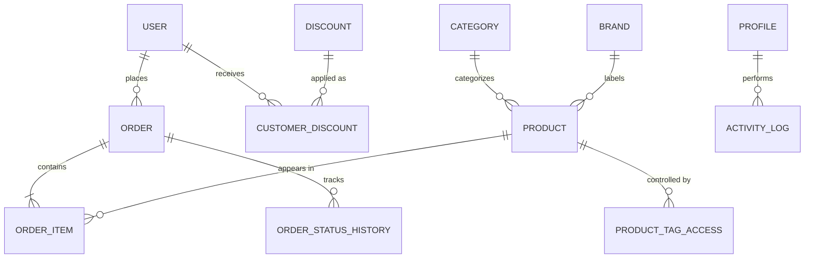

# TechByte Database Documentation

This document provide a detailed overview of the database architecture, schema models, and data relationships for the TechByte project.

## Overview

TechByte uses **PostgreSQL** (hosted on **Supabase**) as its primary database. The schema is managed using **Prisma ORM**, which provides type-safe access and automated migrations.

- **Primary DB**: PostgreSQL
- **ORM**: Prisma
- **Provider**: Supabase

---

## Entity Relationship Diagram (ERD)

Below is a visual representation of how the core tables relate to one another.

---

## Detailed Schema Models

### 1. Product & Catalog
- **`Product`**: Stores all technical specifications (Storage, RAM, Model, Warranty) and B2B specific fields like `isPrivate` (for catalog visibility) and `variantPrice`.
- **`Category`**: Hierarchical grouping (e.g., Laptops, Mobile Phones).
- **`Brand`**: Manufacturer management (e.g., Apple, Samsung).
- **`ProductTagAccess`**: Junction table that matches product privacy tags with customer access tags.

### 2. User & Authentication
- **`User`**: A complex model for B2B customers. Includes:
    - **Company Data**: Name, Address, Tax ID, Registration Certificate.
    - **Financial Data**: Bank details (IBAN, Swift).
    - **Points of Contact**: CEO, Sales, Purchase, and Logistics manager details.
    - **Approval State**: `status` (pending/approved/declined) and `declineReason`.
- **`Profile`**: Simple identity table for system roles (`admin` or `customer`).
- **`session`**: Stores Express session data in a dedicated PostgreSQL table for persistence across server restarts.

### 3. Orders & Transactions
- **`Order`**: Tracks totals (subtotal, VAT, shipping) and current delivery status.
- **`OrderItem`**: Records the specific price of a product at the moment of sale to handle future price fluctuations.
- **`OrderStatusHistory`**: A timeline of events for every order (e.g., "Payment Received" -> "In Production" -> "Shipped").

### 4. Marketing & Auditing
- **`Discount`**: Defines global discount types (Fixed or Percentage).
- **`CustomerDiscount`**: Maps specific discounts to specific B2B users.
- **`ActivityLog`**: A strict audit trail tracking every "who, what, when, and where" for admin actions (CRUD on products, changing order statuses, etc.).
- **`EmailTemplate`**: Stores dynamic HTML templates for automated customer notifications.

---

## Database Flow

### 1. Catalog Filtering
When a user browses the shop, the database performs a join between `Product` and `ProductTagAccess`. If the user has matching tags in their `User.accessTags` array, private products become visible.

### 2. Checkout Flow
1. **Order Creation**: A new record is inserted into `Order`.
2. **Item snapshot**: Cart items are copied into `OrderItem` with the current `variantPrice`.
3. **Inventory Update**: `Product.variantInventoryQty` is decremented.
4. **Logging**: An entry is created in `OrderStatusHistory` marking the order as "Pending".

### 3. Admin Audit
Every time an admin modifies a product in the dashboard:
1. Prisma update query runs.
2. A follow-up `ActivityLog` entry is created, capturing the previous and new values of the record.
